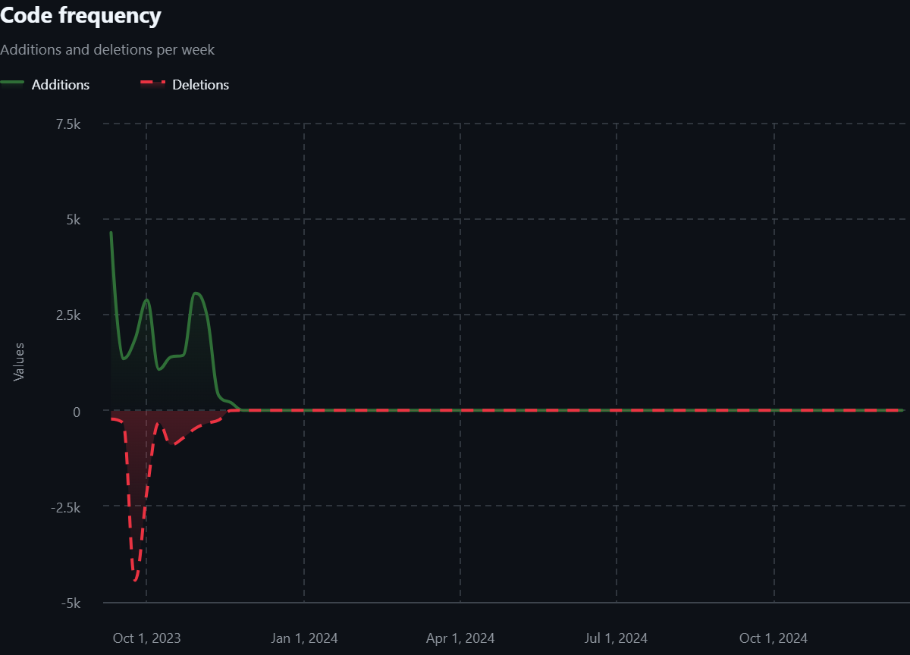

Hola, en este post voy a intentar explicar brevemente el proyecto que he estado desarrollando, Godosters.

## Origen

La idea de Godosters es que sea un proyecto base para crear juegos al estilo Pokémon. La idea viene de que Pokémon Essentials está hecho en RPG Maker XP y es un software muy antiguo y me gustaba la idea de hacer lo mismo pero con una base más moderna. Es un proyecto que pensé hace mucho tiempo y la idea era hacer un motor de juegos de Pokémon para mi trabajo de final del grado universitario, pero al final decidí reducir la carga y hacer un aspecto del motor, y así nació [Elit3D](https://christt105.itch.io/elit3d), un editor de mapas por tiles en 3D. La idea era ir ampliando el proyecto hasta hacer toda la base en C++, pero desde que acabé la universidad he estado trabajando a jornada completa y no he podido dedicar mucho tiempo a mis proyectos personales. He ido trabajando de forma intermitente tanto en Elit3D como en Godosters.

## Evolución

### Pokémon Esmeralda Godot 3

La verdad que el desarrollo de este proyecto ha sido una montaña rusa. Descarté la idea de seguir usando C++ por la complejidad que añade y decidí hacer una prueba en 2022 con Godot. Empecé usando Godot 3, ya que Godot 4 aún no había salido oficialmente, creo recordar. La idea era probar Godot a ver que podía ofrecer. Estuve un mes aprendiendo y desarrollando. Hice cosas muy básicas, el movimiento del jugador, un par de NPCs y el principio del sistema de diálogo. Se puede ver en este vídeo:



### Kip Unity Framework

Unos días después empecé lo que llamé KipUnityFramework, lo que iba a ser un proyecto de Unity para hacer juegos de Pokémon. No recuerdo muy bien por qué cambié de Godot a Unity, imagino que quería hacer algo con C# y estar orgulloso de mi código. Ahí avancé bastantes avances. Básicamente lo empecé para aprender a hacer shaders en Unity y fui añadiendole más cosas. Estas son algunas de las cosas que hice:
* Un shader para renderizar un fondo infinito
* Un sistema de tiles temporales como las huellas en la arena
* Un shader que imita el reflejo en el agua del Pokémon Esmeralda
* El principio de la introducción con todas sus animaciones y efectos
* Un sistema de scripting por nodos, con el que hice la introducción del profesor Abedul

Para quien le interese, estuve subiendo los vídeos en esta lista de reproducción: [Pokémon Emerald Unity por christt105](https://youtube.com/playlist?list=PL9EieIseZRQD4dVf_MWqubnc0_0wV6vZj&si=mtHnbZRdVdDaFLJU)

Estuve trabajando de forma intermitente durante un año aproximadamente. Hasta que en Septiembre de 2023 ocurrió la problemática de Unity con sus nuevas tarifas. Habiendo salido ya Godot 4, decidí volver a cambiar otra vez de motor a Godot.

### Godosters

Ahora sí, me enamoré de Godot. Empecé creando el movimiento del personaje. Estaba (y estoy) aprendiendo así que hay muchas cosas que he ido cambiando y he de cambiar en un futuro. Este fue el primer vídeo que tengo del proyecto de Godosters.

Poco a poco fui añadiendo todo lo que hice en Unity en Godosters. Estaba interesado en los shaders y la verdad que la simpleza para hacer los shaders me encantó. Hice el [shader del agua](https://godotshaders.com/shader/sprite-water-reflection-pixel-art/) y el del [fondo infinito (o unmoving plaid effect)](https://godotshaders.com/shader/infinite-sprite/). Mi idea es hacer un post explicando cada uno ya que son muy simples y pueden ser interesantes.

 



