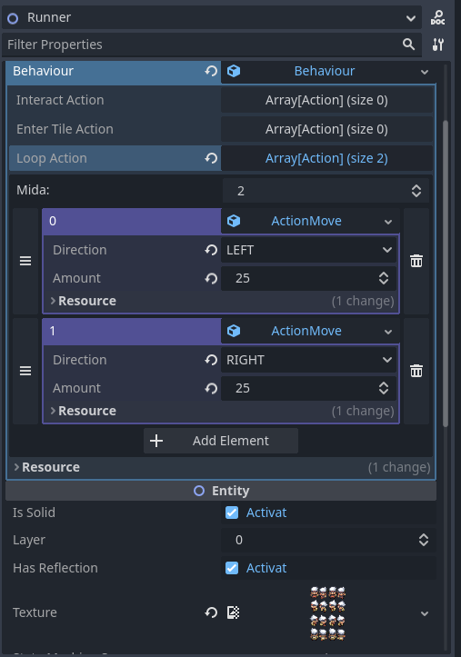

Hola, en este post voy a intentar explicar brevemente el estado actual del proyecto que he estado desarrollando, **Godosters**.

## Descripción

Godosters es un motor para crear juegos al estilo de Pokémon. Es un proyecto que nació hace varios años y ha estado cambiando de tecnología hasta quedarse en Godot 4. En un futuro haré un post sobre la evolución y las decisiones que me llevaron a acabar usando Godot.

Ahora mismo es un proyecto base de Godot con algunas funcionalidades, pero el objetivo es acabar haciendo todas las herramientas para que no se necesiten conocimientos técnicos de Godot para crear los juegos.

Ahora es un proyecto privado, pero en cuanto tenga algo estable lo haré público. El objetivo es que no tenga muchas dependencias y esté todo hecho en GDScript, o GDExtensions cuando sea realmente necesario.

## Funcionalidades actuales

En este blog voy a ir haciendo un diario de las funcionalidades y cambios del proyecto. Vamos a hacer un repaso de las funcionalidades actuales. Si hay alguna que te guste y te gustaría saber cómo la he hecho, házmelo saber en los comentarios.

Una pequeña demostración del estado actual del proyecto en un vídeo:



### Shader reflejo del agua

Aún recuerdo la primera vez que llegué a Ciudad Petalia y me vi reflejado en ese lago al lado de ese niño. Era un efecto que pensé que sería fácil de implementar, como primer efecto para hacer. Estaba interesado en los shaders y la verdad que la simpleza para hacer los shaders en Godot me encantó. Se asemeja bastante a GLSL. Hice el [shader del agua](https://godotshaders.com/shader/sprite-water-reflection-pixel-art/), tenéis toda la información en el enlace. Puedes activarlo en cada entidad, cambiarle el color y su posición. Por ejemplo, en el vídeo se ve cómo, en el puente, el reflejo del jugador y del Kecleon está unos tiles por debajo y con un color oscuro.

### Shader de fondo infinito (Unmoving Plaid)

Continuando con los shaders, hice el del [fondo infinito (o unmoving plaid effect)](https://godotshaders.com/shader/infinite-sprite/). La idea del proyecto es que cada mapa tenga un tamaño fijo, para calcular bien los límites de cada mapa y juntarlos. El problema con esto es que, si el personaje va al borde del mapa, se verá el fondo (a no ser que se rellene todo). Para evitar carga de trabajo adicional, he creado un shader que dibuja una imagen continua donde esté el fondo. Cada mapa contará con la posibilidad de añadir una imagen de fondo para no tener que preocuparte por pintar más allá de los límites del mapa.

### Sistema de Mapas

Para el sistema de mapas pensé en hacer que cada escenario fuera una escena heredada de un mapa plantilla. He leído que la herencia de escenas no es la mejor solución, pero de momento lo tengo así. Cada mapa contiene unos atributos, que de momento solo es el tamaño en tiles del escenario y las conexiones con otros escenarios. 

  

Dentro de cada escena de mapa está el nodo TileMap donde se pinta todo, aunque no está actualizado con el nuevo sistema de tilemaps de Godot. He declarado algunos valores Z para definir qué se va a pintar antes o después; por ejemplo, los reflejos tienen un valor de -15. 

Seguidamente, tenemos una colección de TileMaps de comportamiento. En estos TileMaps se asignan las propiedades de cada tile pintando con diferentes sprites: puedes bloquear completamente el paso o por dirección. También puedes pintar el ID del tile; por ejemplo, si es agua, deja huellas, etc. Una vez pintado, hay que hacer clic en un botón para que se aplique sobre la capa. Al haber varios TileMaps de comportamiento, se pueden activar y desactivar durante la partida. Por ejemplo, en el vídeo se ve un puente, el de la ruta 120, con dos TileMaps de comportamiento: uno que bloquea el paso al agua cuando estás por encima del puente, y otro por debajo. Cuando pasas por el puente se cambia el TileMap usado. Es un sistema aún en pañales y que necesita muchos cambios. La idea es que modifiques todo esto sin realmente ver qué está pasando por debajo, con una herramienta dedicada a eso.

Finalmente, tenemos una lista de "Actores" o eventos. Son los NPC o los objetos físicos que tienen un comportamiento.

### Actores

Un actor es una entidad con comportamiento. A las entidades puedes aplicarles ajustes como ponerles una textura, decidir si tienen reflejos, la capa donde se aplican o si son sólidos.

Los actores tienen un campo donde puedes añadirles un comportamiento. Cada objeto de comportamiento tiene unas funciones que se disparan dependiendo de cómo interactúes con ellos; por ejemplo, al pulsar el botón de acción delante de ellos, al entrar en el tile donde esté la entidad o constantemente en un bucle. Le puedes añadir una lista de acciones y las hará en orden. Tienes diferentes acciones y la idea es que cada usuario pueda crear acciones que use recurrentemente. Ahora está todo en el inspector de una forma muy arcaica. La idea en un futuro es crear una especie de lenguaje para tenerlo todo en un archivo. También está la idea de poder hacerlo con nodos, como hice en [Kip Unity Framework](https://youtu.be/_zOz2Mj4AMI?si=Zeix66XkwtTjLc9d). Creo que puede estar muy bien para quienes no les gusta mucho programar.

 

### Sistema de Batalla

No voy a negar que el sistema de batalla es lo que menos me apetece hacer. Tiene tantas variables y es todo tan complejo que es mucho trabajo para que quede algo decente. He hecho un sistema muy básico, que iré ampliando cuando lo necesite.

He pensado en usar el motor de batallas de Showdown para no tener que aplicar toda la lógica y que todo funcione perfecto, pero realmente no estoy seguro si se puede hacer. He de investigar.

### Base de Datos

Todo lo del manejo de datos es algo que me gusta y, a su vez, es lo que creo que hizo que me tomara un descanso bastante largo con este proyecto. En Kip Unity Framework tenía cada Pokémon y cada característica de cada especie en ScriptableObjects. La idea de tenerlo todo por assets y que pudieras tenerlo todo separado es algo que me gustaba mucho. El problema es que intenté replicar lo mismo en Godot con los Resources y no es igual. Son una herramienta muy buena, pero no están pensados para eso. El principal problema es tener referencias cíclicas. Es un [tema bastante debatido en la comunidad](https://github.com/godotengine/godot-proposals/issues/7363) y hay opiniones muy diversas. Cuando estaba desarrollando el proyecto, vi que en futuras versiones iban a implementar los .uid para cada archivo y pensé que lo mismo era una solución. He estado mirando de vez en cuando y realmente no sé si seguir con esta implementación o buscar algo diferente para la base de datos.

 

## Demo

Aunque esté roto por todos los sitios, voy a intentar publicar una build en cada devlog para ir viendo el avance del proyecto. Tened en cuenta que es una versión muy temprana del proyecto y que muchos sistemas no funcionan o necesitan tener el editor abierto para funcionar.

- 🐧 [Descargar Godosters v0.1.0 para Linux](https://github.com/christt105/blog/releases/download/Godosters_v0.1.0/Godosters_v0.1.0-linux.zip)
- 🪟 [Descargar Godosters v0.1.0 para Windows](https://github.com/christt105/blog/releases/download/Godosters_v0.1.0/Godosters_v0.1.0-windows.zip)

## Futuro

La verdad es que no tengo muy claro hasta dónde voy a llegar con este proyecto. Es un proyecto personal al que no le voy a sacar rédito económico, por lo que trabajo en él cuando el tiempo y las ganas me lo permiten. Estoy muy contento con Godot, por lo que es seguro que lo voy a mantener en este motor. Unity ya sé que no es el motor para mis proyectos personales por sus políticas y lo que puede llegar a pasar. Por otro lado, hacerlo de cero con C++ es tantísimo trabajo que no avanzaría nada. Godot es el punto perfecto entre versatilidad y donde realmente siento míos mis proyectos.

Aún me queda mucho por aprender de Godot, pero me está gustando. Mi intención con este proyecto es poder hacer todo lo posible sin librerías externas y todo en GDScript. El proyecto no está para ver, por lo que lo mantendré en privado una temporada más, pero si en algún momento empiezo a tener algo suficientemente estable y estoy orgulloso de lo que he hecho, lo haré público.

Este último año he estado bastante ocupado y no le he dedicado nada de tiempo. A ver si ahora empiezo a tener algo más de tiempo libre y me motivo con el blog para continuar con el desarrollo.

Y hasta aquí el primer post con contenido. Hay muchas cosas de las que quiero hablar y proyectos que comentar, por lo que intentaré estar más activo.

Nos vemos con más actualizaciones. 

Adiós!