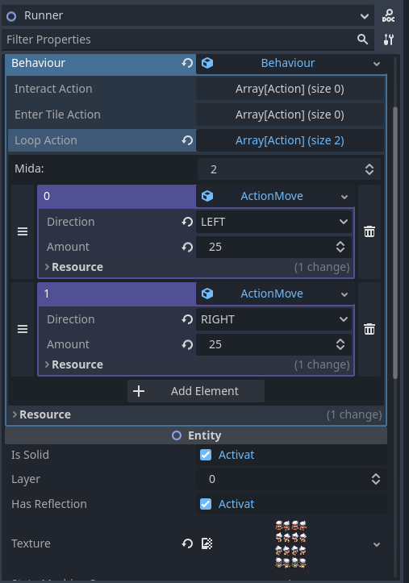
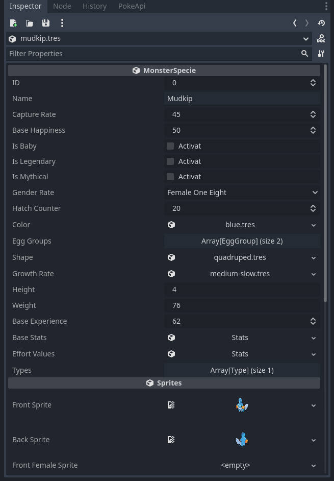

Hi! In this post, I’m going to briefly explain the current state of the project I’ve been working on: **Godosters**.

## Description

Godosters is an engine for creating Pokémon-style games. It’s a project I started several years ago and has switched technologies a few times before settling on Godot 4. In the future, I’ll write a post about the evolution and the decisions that led me to use Godot.

Right now, it’s a Godot base project with some core features, but the goal is to build all the necessary tools so users won’t need to know Godot in order to create their games.

It’s currently private, but as soon as I have something stable, I’ll make it public. The idea is to minimize dependencies and write everything in GDScript or GDExtensions when truly needed.

## Current Features

In this blog, I’ll be writing a devlog covering features and changes in the project. Let’s go over the current features. If you like any and want to know how I built it, let me know in the comments.

A short demonstration of the current project state in video format:



### Water Reflection Shader

I still remember the first time I reached Petalburg City and saw my reflection in the lake next to that kid. It was an effect I thought would be easy to implement, so I chose it as my first one. I was interested in shaders, and honestly, Godot’s simplicity for writing shaders blew me away. It’s quite similar to GLSL. I made this [water shader](https://godotshaders.com/shader/sprite-water-reflection-pixel-art/), and you can find all the details in the link. You can activate it per entity, change the color, and adjust the position. For example, in the video you can see how the player and Kecleon’s reflection under the bridge is a few tiles lower and tinted darker.

### Infinite Background Shader (Unmoving Plaid)

Continuing with shaders, I created one for the [infinite background (aka unmoving plaid effect)](https://godotshaders.com/shader/infinite-sprite/). The idea is that each map has a fixed size, which helps in calculating boundaries and connecting maps. The problem is that, when the character reaches the map’s edge, the background becomes visible—unless everything is filled in. To reduce extra workload, I created a shader that renders a continuous image for the background. Each map will support adding a background image, so you don’t need to paint beyond its limits.

### Map System

For the map system, I chose to make each area a scene inherited from a map template. I’ve read that scene inheritance isn’t the best solution, but that’s how it’s set up for now. Each map includes some attributes—for now, just the map size in tiles and connections to other areas.

 

Inside each map scene is a TileMap node where everything is drawn, although it’s not yet updated to Godot’s new tilemap system. I’ve defined some Z-index values to determine draw order—for example, reflections are set to -15.

Next, there’s a collection of behavior TileMaps. These assign properties to tiles by painting with different sprites: you can block movement completely or directionally. You can also assign a tile ID, like if it's water or leaves footprints, etc. After painting, you need to click a button to apply the data to the layer. Since there can be multiple behavior TileMaps, they can be toggled on or off during gameplay. For example, in the video, you see a bridge on Route 120 using two behavior TileMaps—one blocks water when you’re above the bridge, and the other is used below. When crossing the bridge, the active TileMap changes. It’s still an early-stage system that needs many improvements. The goal is to let you modify all this through a dedicated tool without worrying about what’s going on behind the scenes.

Lastly, there’s a list of "Actors" or events. These are NPCs or physical objects that have behaviors.

### Actors

An actor is an entity with behavior. You can assign things like textures, whether it reflects, the layer it uses, or if it’s solid.

Actors have a field where you can attach a behavior script. Each behavior object has functions that trigger depending on how you interact with them—for example, pressing the action button in front of them, entering their tile, or running continuously in a loop. You can add a list of actions, and they’ll execute in order. There are various actions available, and users can create reusable ones. Right now, everything is set in the inspector in a very rough way. In the future, I’d like to create a simple language that lets you define everything in a file. There’s also the idea of using nodes, like I did in [Kip Unity Framework](https://youtu.be/_zOz2Mj4AMI?si=Zeix66XkwtTjLc9d), which I think could be great for people who don’t like coding.

 

### Battle System

I won’t lie—the battle system is what I least feel like doing. It has so many variables and is so complex that it takes a lot of work to make something decent. I’ve built a very basic system that I’ll expand as needed.

I’ve considered using the Showdown battle engine so I don’t have to implement the entire logic and guarantee it works perfectly, but I’m not really sure if that’s possible. I need to investigate it.

### Database

I really like data management, but it’s also what made me take a long break from the project. In Kip Unity Framework, I used ScriptableObjects for each Pokémon and every characteristic per species. Having everything separated by assets was something I liked a lot. The problem came when I tried to replicate this in Godot with Resources—it’s just not the same. They’re a great tool but not designed for this. The main issue is circular references. It’s a [hot topic in the community](https://github.com/godotengine/godot-proposals/issues/7363) and opinions vary widely. During development, I saw that future versions would support `.uid` for each file and thought that might solve it. I’ve been checking occasionally, but I’m still unsure whether to stick with this system or try something else for the database.

 

## Demo

Even though it’s broken in many ways, I’ll try to release a build with each devlog to show the project’s progress. Keep in mind this is a very early version, and many systems don’t work or require the editor to run.

- 🐧 [Download Godosters v0.1.0 for Linux](https://github.com/christt105/blog/releases/download/Godosters_v0.1.0/Godosters_v0.1.0-linux.zip)
- 🪟 [Download Godosters v0.1.0 for Windows](https://github.com/christt105/blog/releases/download/Godosters_v0.1.0/Godosters_v0.1.0-windows.zip)

## Future

Honestly, I don’t know how far I’ll go with this project. It’s a personal project with no commercial intent, so I work on it whenever I have time and motivation. I’m really happy with Godot, so I’m definitely sticking with it. I know Unity isn’t the right engine for my personal projects anymore due to its policies and the risks involved. Starting from scratch with C++ would be way too much work and wouldn’t lead to progress. Godot is the perfect balance of flexibility and giving me the feeling that the project is truly mine.

I still have a lot to learn about Godot, but I’m enjoying it. My goal is to build everything without external libraries and using only GDScript. The project isn’t public yet, so I’ll keep it private for a bit longer, but if I eventually have something stable and I’m proud of it, I’ll release it.

This past year has been really busy and I haven’t had time to work on it. Hopefully, I’ll have more free time now, and this blog will motivate me to keep going.

That’s it for this first content post. I’ve got lots to talk about and more projects to share, so I’ll try to stay more active.

See you in the next update.

Goodbye!
